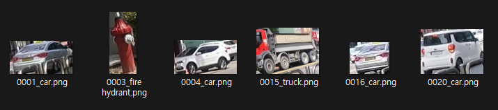
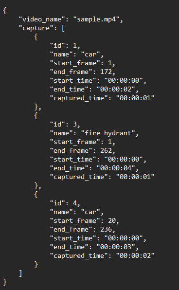

## Object Extractor
Extract objects that have been tracked for more than `threshold` frames.

### Installation

```bash
git clone https://github.com/dh031200/ObjectExtractor.git --recursive
cd ObjectExtractor
pip install -r requirements.txt
```

### Usage

```bash
python track.py --source sample.mp4 --model yolov8n.pt --appeared 100 --save-vid
```

### Arguments

* `--source <video.mp4>` source video
* `--model <model.pt>` default: yolov8n.pt
* `--appeared <threshold>` capture threshold
* `--show` : display video while program is running
* `--save-vid` : save results video
* `--verbose` : print verbose

### Detection configuration (config.yaml)
#### Default
* conf: 0.25   
  └ confidence score threshold
* iou: 0.7   
  └ intersection over union threshold
* half: False   
  └ enable half precision (FP16)
* device:   
  └ set gpu devices for inference
* save_dir: 'runs'   
  └ set save directory
* show_conf: True   
  └ Whether to show confidence score in labels
* show_labels: False    
  └ Whether to show labels
* show_boxes: True   
  └ Whether to show bounding boxes
* line_width: 0.0   
  └ the line width of the bounding boxes.
* classes:   
  └ filter results by class, i.e. class=0, or class=[0,2,3]

### Results

#### images



#### log


